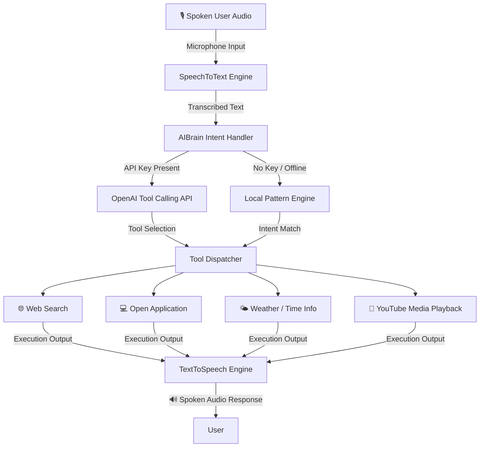

# 🤖 JARVIS — Next-Gen Autonomous AI Voice Assistant

<p align="center">
  
  
  
  
  
</p>

> **JARVIS** is a modular, production-grade, hands-free personal AI voice assistant built in Python. Powered by **OpenAI LLM Tool Calling (Function Calling)**, JARVIS converts natural spoken voice input into real-time operating system actions, web searches, media playback, and weather/utility reports.

---

## ✨ Key Features

- 🎙️ **Hands-Free Speech Recognition**: Continuous listening with automatic background ambient noise calibration using `speech_recognition`.
- 🧠 **LLM Tool Calling Integration**: Driven by OpenAI `gpt-4o-mini` function calling. JARVIS intelligently maps intent to Python functions.
- ⚡ **Rule-Based Local Fallback**: Works out-of-the-box even without an OpenAI API key! Uses a regex pattern engine when offline or keyless.
- 🗣️ **Offline Text-to-Speech (TTS)**: Natural voice synthesis via `pyttsx3` supporting Windows SAPI5 / cross-platform voice engines.
- 💻 **System & Desktop Control**: Launch applications like Notepad, Calculator, Chrome, Command Prompt, Task Manager, Paint, and File Explorer.
- 🌐 **Web Search & YouTube Automation**: Instant Google searching and hands-free YouTube music/video playback via `pywhatkit`.
- 🌤️ **Real-Time Utilities**: Hands-free queries for local weather (`wttr.in`), exact time, date, and day of the week.

---

## 🏗️ System Architecture



---

## 📁 Repository Structure

```text
My_Own_Assistant/
│
├── main.py               # 🚀 Main execution loop & ambient noise calibrator
├── ai_brain.py           # 🧠 OpenAI Function Calling & fallback intent engine
├── speech_engine.py      # 🎙️ STT (mic capture) & TTS (audio synthesis) engine
├── tools.py              # ⚙️ Operating system & web tool implementations
├── config.py             # 🔧 System settings, voice options & app mappings
├── test_assistant.py     # 🧪 Automated suite verification script
├── requirements.txt      # 📦 Required Python dependencies
├── .env.example          # 🔑 Environment key configuration template
└── README.md             # 📖 Documentation
```

---

## ⚙️ Operating System Tools Matrix

| Tool | Function Name | Supported Spoken Intents / Commands |
| :--- | :--- | :--- |
| **App Launcher** | `open_application` | *"Open Notepad"*, *"Launch Calculator"*, *"Start Chrome"*, *"Open Task Manager"* |
| **Web Search** | `web_search` | *"Search Google for Python tutorials"*, *"Look up artificial intelligence"* |
| **Media Player** | `play_media` | *"Play Bohemian Rhapsody on YouTube"*, *"Play Lofi hip hop music"* |
| **Utility Info** | `get_utility_info` | *"What's the time?"*, *"What day is it?"*, *"What is the weather in Tokyo?"* |

---

## 🚀 Quick Start Guide

### 1. Clone the Repository
```bash
git clone https://github.com/MadihaSehar/My_Own_Assistant.git
cd My_Own_Assistant
```

### 2. Install Dependencies
```bash
pip install -r requirements.txt
```

> **Note for Windows PyAudio Installation**:
> If installing `pyaudio` throws a build error on Windows, run:
> ```bash
> pip install pipwin
> pipwin install pyaudio
> ```

### 3. Environment Setup (Optional)
Copy `.env.example` to `.env` and insert your OpenAI API Key:
```bash
cp .env.example .env
```
Edit `.env`:
```env
LLM_PROVIDER=openai
OPENAI_API_KEY=sk-proj-your_openai_api_key
OPENAI_MODEL=gpt-4o-mini
```
*Note: If no API key is set, JARVIS will seamlessly run using the **Local Pattern Fallback Engine**!*

### 4. Launch JARVIS
```bash
python main.py
```

---

## 🧪 Verification & Testing

To run the automated test suite and verify system execution:
```bash
python test_assistant.py
```

---

## 🧩 How to Extend JARVIS with New Commands

Adding custom tools to JARVIS takes just 3 simple steps in [`tools.py`](file:///C:/Users/madih/.gemini/antigravity/scratch/voice_assistant/tools.py):

### 1️⃣ Write your Python function:
```python
def check_battery() -> str:
    """Returns battery percentage."""
    import psutil
    battery = psutil.sensors_battery()
    return f"Your battery is at {battery.percent}%"
```

### 2️⃣ Define its OpenAI JSON Tool Schema in `TOOLS_SCHEMA`:
```python
{
    "type": "function",
    "function": {
        "name": "check_battery",
        "description": "Gets current laptop battery percentage.",
        "parameters": {"type": "object", "properties": {}}
    }
}
```

### 3️⃣ Register it in `TOOL_DISPATCHER`:
```python
TOOL_DISPATCHER = {
    ...
    "check_battery": check_battery
}
```

---

## 🤝 Contributing

Contributions, issues, and feature requests are welcome! Feel free to check the [issues page](https://github.com/MadihaSehar/My_Own_Assistant/issues).

---

## 📜 License

Distributed under the MIT License. See `LICENSE` for more information.
